<div align=center>
<p style="font-size:20px"> Report about Project 3 - Sentiment Analysis </p>
</div>

<div style="page-break-after: always"></div>

<div align=center>
<p style="font-size:15px; margin=20px"> Table of Content </p>
</div>

[toc]

<div style="page-break-after: always"></div>

## 1. Background

In the final project, We will do an experiment with web crawling,  infomation extracting and indexing to make document ranking reflect sentiment with the help of **aFinn** sentiment dictionary. And then We will do a comprehensive tests and analyze results.

## 2. Introduction

### 2.1 Information Crawling & Extracting

The first and important thing of the project is to generate source data for following operations, like indexing and query. The method we apply here is to crawl webpages and then extract useful information stored in text files.

#### 2.1.1 Web Crawlers - **Scrapy**

Even though **Scrapy** was originally designed for web scraping, it can also be used to extract data using APIs (such as Amazon Associates Web Services) or as a general purpose web crawler, in a fast, simple, yet extensible way.

> **Scrapy** is an application framework for crawling web sites and extracting structured data which can be used for a wide range of useful applications, like data mining, information processing or historical archival.

The following diagram shows an overview of the Scrapy architecture with its components and an outline of the data flow that takes place inside the system (shown by the red arrows). A brief description of the components is included below. The data flow is also described below.

<div align=center>
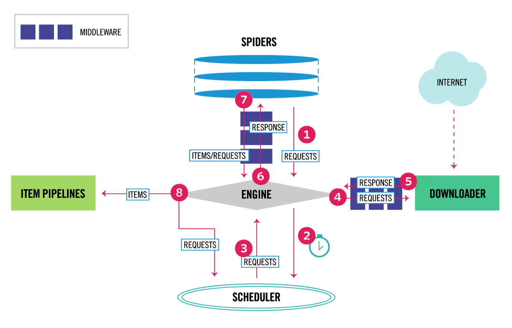
<p style="font-size:10px;font-color:#969696">Figure 2.1 Scrapy Data Flow </p>
</div>

The data flow in Scrapy is controlled by the execution engine, and goes like this:

1. The Engine gets the initial Requests to crawl from the Spider.
2. The Engine schedules the Requests in the Scheduler and asks for the next Requests to crawl.
3. The Scheduler returns the next Requests to the Engine.
4. The Engine sends the Requests to the Downloader, passing through the Downloader Middlewares.
5. Once the page finishes downloading the Downloader generates a Response and sends it to the Engine, passing through the Downloader Middlewares.
6. The Engine receives the Response from the Downloader and sends it to the Spider for processing, passing through the Spider Middleware.
7. The Spider processes the Response and returns scraped items and new Requests to the Engine, passing through the Spider Middleware.
8. The Engine sends processed items to Item Pipelines, then send processed Requests to the Scheduler and asks for possible next Requests to crawl.
9. The process repeats (from step 1) until there are no more requests from the Scheduler.

#### 2.1.2 Text Extractor - **Beautiful Soup**

Text extraction is the task of separating boilerplate such as comments, navigation bars, social media links, ads, etc, from the main body of text of an article formatted as HTML. 

In this part, we decide to introduce the **Beautiful Soup 4** framework into the project based on the three following features.

> **Bautiful Soup**, is a Python library for pulling data out of HTML and XML files. It works with your favorite parser to provide idiomatic ways of navigating, searching, and modifying the parse tree.

1. Beautiful Soup provides a few simple methods and Pythonic idioms for navigating, searching, and modifying a parse tree: a toolkit for dissecting a document and extracting what you need. It doesn't take much code to write an application
2. Beautiful Soup automatically converts incoming documents to Unicode and outgoing documents to UTF-8. You don't have to think about encodings, unless the document doesn't specify an encoding and Beautiful Soup can't detect one. Then you just have to specify the original encoding.
3. Beautiful Soup sits on top of popular Python parsers like lxml and html5lib, allowing you to try out different parsing strategies or trade speed for flexibility.

### 2.2 Information Indexing

#### 2.2.1 **SPIMI** Algorithm

To implememnt rudimentary information retrieval, we will create an indexer using the **SPIMI** algorithm.

>**SPIMI** uses terms instead of termIDs, writes each block's dictionary to disk, and then starts a new dictionary for the next block. SPIMI can index collections of any size as long as there is enough disk space available.

The SPIMI algorithm pseudocode is shown below:

```
SPIMI-INVERT(token_stream)
	output_file = NEWFILE()
	dictionary = NEWHASH()
	while (free memory available)
	do token <- next(tolen_steam)
		if term(token) ∉ dictionary
			then postings_list = ADDTODICTIONARY(dictionary, term(token))
			else postings_list = GETPOSTINGSLIST(dictionary, term(token))
		if full(postings_list)
			then postings_list = DOUBLEPOSTINGSLIST(dictionary, term(token))
		ADDTOPOSTINGSLIST(postings_list, doc_ID(token))
	sorted_terms <- SORTTERMS(dictionary)
	WRITEBLOCKTODISK(sorted_terms, dictionary, output_file)
	return output_file
```

The part of the algorithm that parses documents and turns them into a stream of term-docID pairs, which we call tokens here, has been omitted. SPIMI-INVERT is called repeatedly on the token stream until the entire collection has been processed.

Tokens are processed one by one during each successive call of SPIMI-INVERT. When a term occurs for the first time, it is added to the dictionary (best implemented as a hash), and a new postings list is created.

#### 2.2.2 Natural Language Toolkit - **NLTK**

**NLTK** will be used to preprocess documents crawled by the scrapy, like tokenization, stemming and removing stopwords.

>**NLTK** is a leading platform for building Python programs to work with human language data. It provides easy-to-use interfaces to over 50 corpora and lexical resources such as WordNet, along with a suite of text processing libraries for classification, tokenization, stemming, tagging, parsing, and semantic reasoning, and wrappers for industrial-strength NLP libraries.

### 2.3 Probabilistic Search Engine

#### 2.3.1 **TF-IDF** Algorithm

To reflect how relevant a term is in a given document, we will appy the **TF-IDF** algorithm as a part of the scoring function in the project.

>**TF-IDF** is an information retrieval technique that weighs a term’s frequency **(TF)** and its inverse document frequency **(IDF)**. Each word or term has its respective TF and IDF score. The product of the TF and IDF scores of a term is called the TF*IDF weight of that term. 

**Put simply, the higher the TF-IDF score (weight), the rarer the term and vice versa.**

The TF-IDF algorithm is used to weigh a keyword in any content and assign the importance to that keyword based on the number of times it appears in the document. More importantly, it checks how relevant the keyword is throughout the web, which is referred to as corpus.

For a term $t$ in a document $d$, the weight $W_{t, d}$ of term $t$ in document $d$ is given by:

$W_{t,d} = tf_{t, d} \times idf_{t}$

We can see a few common components like $tf_{t, d}$ and $idf_{t}$. Here’s what each of these is all about:

1. **$tf_{t, d}$** is the number of occurrences of $t$ in document $d$.

	For example, when a 100 word document contains the term “sentiment” 12 times, the TF for the word ‘sentiment’ is
	
	$tf_{sentiment} = 12/100 = 0.12$
	
	But relevance does not increase proportionally with term frequency. We here decide to apply **Log frequency weighting** instead of raw frequency.
	
	$(1 + \log tf_{t,d})$  if tf_{t, d} > 0

2. **$idf_{t}$** is a measure of the informativeness of the term $t$.

	The IDF component of our formula measures how often a term occurs in all of the documents and “penalizes” terms that are common. The actual formula tf-idf uses for this part is:

	$IDF(q_i) = \log[\frac{N}{df_t}]$
	* **N** is the number of documents in the collection
	* **$df_t$** is the document frequency of the ith query term.
	
So, the final **tf-idf** formula that we will use in the project is:

$W_{t,d} = (1 + \log tf_{t,d}) \times(\log {\frac{N} {df_t}})$

With words having a high TF*IDF weight in our content, our content will always be among the top search results, so benifits that we have are:

1. Stop worrying about using the stop-words,
2. Successfully hunt words with higher search volumes and lower competition,
3. Be sure to have words that make our content unique and relevant to the user, etc.

#### 2.3.2 Sentiment Dictionary - **aFinn**

To associate sentiment values to each term in our index, we will apply **aFinn**, specifically **AFINN-111.txt**, as the sentiment dictionary.

>**AFINN** is a list of English words rated for valence with an integer
between minus five (negative) and plus five (positive). The words have
been manually labeled by Finn Årup Nielsen in 2009-2011. The file
is tab-separated. 

Word associated with sentiment score between **$−5$ (most negative)** and **$+5$ (most positive)**, like:

1. abandon	$-2$
2. abhor		$-3$
3. ability	$2$
4. aboard		$1$

#### 2.3.3 Sentiment Aggregation Function

To associate sentiment to individual documents, we have to develop a simple sentiment aggregation function to calculate their sentiment values.

Our idea is to take some text (e.g. document text, query text) as argument. It then splits all the text into lowercased words, and if some of the words appear in the AFINN-111.txt file, the associated values to the words are summed up to provide the sentiment score. Here is the code:

```python
def sentiment_aggr_function(some_text):
    afinn = dict(map(lambda p: (p[0], int(p[1])), [line.split('\t') for line in open("AFINN-111.txt")]))
    sentiment_aggr = sum(map(lambda word: afinn.get(word, 0), some_text.lower().split()))
    return sentiment_aggr

```

#### 2.3.4 Ranking Function

To rank retrieved documents, we have to develop a simple ranking function to sort them by a partial order on ($w,s$)

Before formulating the partial order function, it is necessary to obtain the values of the arguments needed in the function (i.e. w and s). The approaches taken for obtaining these values are as follows:

1. $w$ is tf-idf based cosine distance to the query. The function for finding the cosine similarity between a query and document is 

	$\cos(\vec{q}, \vec{p}) = SIM(\vec{q}, \vec{p}) = \frac{\vec{q}\times\vec{p}} {\left|\vec{q}\right| \left|\vec{p}\right|} = \frac{\sum_{i = 1}^{\left|V\right|}{q_i\times d_i}}{\sqrt{\sum_{i = 1}^{\left|V\right|}{q_i^2}} \sqrt{\sum_{i = 1}^{\left|V\right|}{d_i^2}}}$
	
	1. $q_i$ represents the tf-idf weight of the term $i$ in the query.
	2. $d_i$ represents the tf-idf weight of the term $i$ in the document.

2. $s$ is a sentiment bias. As mentioned in the project instruction, the sentiment bias should obey the following principle: 

1. If the query has **overall positive** sentiment, set $s_1 \leq s_2$ if $s_1$ is **more positive** than $s_2$.
2. If the query has **overall negative** sentiment, set $s_1 \leq s_2$ if $s_1$ is **less positive** than $s_2$
 
The approach taken to make this principle apparent is to define $S$ as the difference   between the query sentiment $S_q$ and the document sentiment $S_d$ (i.e. $S = S_q - S_d$). This value $S$ will be used as the denominator in the partial order function which will be described below.

After obtaining necessary arguments above, now we can define the partial order function below:

$f(w, s) = \frac{w}{\left|S\right|}$

Based on this function, a document with a superior weight and sentiment bias will be ranked higher than others. For this project, the emphasis is put on the sentiment bias. In other words, if a document $d_1$ has a slightly inferior weight than a document $d_2$, but the sentiment for  $d_1$ is significantly higher, then $d_1$ will be ranked higher than $d_2$. For instance, a query has a sentiment value of 10. If a document  $d_1$ with weight $3$ has a sentiment value of $5$ and document $d_2$ with weight $2$ has a sentiment value of $8$, by applying the partial order function:

$f_1(w_1, s_1) = \frac{2}{\left|8 - 10\right|} = \frac{2}{2} = 1$

$f_2(w_2, s_2) = \frac{3}{\left|5 - 10\right|} = \frac{3}{5} \leq 1$

In this case, **$d_1$ should be ranked higher than $d_2$**

## 3. Design & Implementation

According to the description above, we will separate the program into three parts, and implement it in the following six steps:

1. Crawling Information

	1. Web Crawling
	2. Infomation Extracting

2. Creating Indexer 

	1. Data Preprocessing
	2. Indexing
	3. Ranking

3. Query

	1. Query and Rank retrieved documents


### 3.1 Web Crawling

It is the module responsible for crawling webpages using **Scrapy** framwork.

#### 3.1.1 Creating a scrapy project

First, create a scrapy project named **crawler** in the commmand line.

```
> scrapy startproject crawler
```
This will create a tutorial directory with the following contents:

	crawler/
    	scrapy.cfg            # deploy configuration file
    	crawler/              # project's Python module, I will import my code from here
       	 __init__.py
        	items.py          # project items definition file
        	middlewares.py    # project middlewares file
        	pipelines.py      # project pipelines file
        	settings.py       # project settings file
        	spiders/          # a directory where I will later put my spiders
            	__init__.py

#### 3.1.2 Customizing scrapy settings - **settings.py**

The Scrapy settings allows you to customize the behaviour of all Scrapy components, including the core, extensions, pipelines and spiders themselves.

Here is how we customize my crawler (**web_crawler/settings.py**):

```python
BOT_NAME = 'comp479project3'

SPIDER_MODULES = ['comp479project3.spiders']
NEWSPIDER_MODULE = 'comp479project3.spiders'

# Obey robots.txt rules
ROBOTSTXT_OBEY = True
# Set to BFS
DEPTH_PRIORITY = 1
```

#### 3.1.3 Define the spider - **concordia\_about\_spider.py**

Spiders are classes that you define and that Scrapy uses to scrape information from a website (or a group of websites). They must subclass **scrapy.Spider** and define the initial requests to make, optionally how to follow links in the pages, and how to parse the downloaded page content to extract data.

This is the code for my Spider named **about_crawl** to crawl the [Concordia university about webpage](https://www.concordia.ca/about.html). Save it in a file named **concordia_about_spider.py** under the **web_crawler/spiders** directory in my project:

```python
import scrapy
from scrapy.exceptions import CloseSpider
from urllib.parse import urlparse
import re
import os
from pathlib import Path

class ConcordiaAboutSpider(scrapy.Spider):
    name = 'about_crawl'
    allowed_domains = ['concordia.ca']
    start_urls = ['https://www.concordia.ca/about.html']
    max_document_size = 200  # Number of links the crawler will extract
    document_counter = 0
    def parse(self, response):
        if self.document_counter <= self.max_document_size:
            self.document_counter += 1
            soup = BeautifulSoup(response.body.decode('utf-8'), 'html.parser')
            self.extract_content(response.url, soup)
            links = soup.find(id='content-main').find_all('a', href=re.compile(r'.*html$'))  # TODO improve regex
            for link in links:
                yield response.follow(link.get('href'), callback=self.parse)
        else:
            raise CloseSpider('max_document_exceeded')
```

### 3.2 Information Extracting

This part is responsible for extracting all useful information from requests sent by the scrapy engine, coded in the **about_crawl** spider file **(spiders/concordia\_about\_spider.py)**.

```python
from bs4 import BeautifulSoup
from urllib.parse import urlparse
@staticmethod
def extract_content(url, soup):
    sub_titles = urlparse(url).path.split('.')[0].split('/')
    title = '_'.join(sub_titles)[1:]
    tags = ['p', 'span', 'h1', 'h2', 'h3', 'h4', 'h5', 'h6', 'li', 'th', 'td']
    content = ''
    for tag in tags:
    	content += '\n' + '\n'.join([txt.text for txt in soup.find(id='content-main').find_all(tag)])
	ConcordiaAboutSpider.write_content_to_file(url, title, content)
```

### 3.3 Data Preprocessing

In the preprocerssing phase (**preprocessor.py**), we will implement the **Lossy Dictionary Compression** techniques, known as **Normalization**, by removing numbers, blanks, punctuations etc. And then we will tokenize documents extracted by crawler for the next step - indexing.

1. Remove special characters, like punctuations, linefeed/carriage return and other non-alphanumeric characters.

	```python
	def remove_special_characters(words):
		'''Removes punctuations, linefeed/carriage return and other non-alphanumeric characters'''
		special_characters = '!?"#$%&\'()*+,./:;<=>?@[\\]^_`{|}~'
		transtable = str.maketrans('', '', special_characters)
    	processed_words = [term.translate(transtable) for term in words]  # remove punctuations
    	useless_words = ['','s','-','--']
    	processed_words = [term for term in processed_words if term not in useless_words]
    	return processed_words
	```

2. Remove digits

	```python
	def remove_numbers(words):
		'''Remove numbers'''
		processed_words = [term for term in words if not term.isdigit()]
		return processed_words
	```

3. Case Folding

	```python
	def case_folding(words):
		'''Case Folding'''
		processed_words = [term.lower() for term in words]
		return processed_words
	```

4. Remove stopwords

	```python
	def remove_stopwords(stopwords, words):
		'''Remove stopwords'''
		processed_words = [term for term in words if not term in stopwords]
		return processed_words
	```

5. Stemming

	```python
	def stemming(terms):
		'''Stemming'''
		stemmer = PorterStemmer()
		stemmed_terms = [stemmer.stem(term) for term in terms]
		return stemmed_terms
	```

6. Tokenize

	```python
	def tokenize(file_list):
    token_id_pairs = []
    for file_index, file in enumerate(file_list):
        print('Processing ' + file_list[file_index] + '...')
        with open(file, 'r') as file_obj:
            data = file_obj.read()
        if data.__len__() == 0:
            continue
        info = ast.literal_eval(data)
        newid = info['title']
        body = info['content']
        tokens = nltk.word_tokenize(body)
        # Preprocess tokens, aka lazy compression
        tokens = remove_special_characters(tokens)
        tokens = remove_numbers(tokens)
        tokens = case_folding(tokens)
        tokens = remove_stopwords(stop_words_30, tokens)
        tokens = stemming(tokens)
        for token in tokens:
            token_id_pairs.append((token, newid))
        print('Tokenization for ' + file_list[file_index] + ' completed...')
    print('Tokenization for all files completed...')
    return token_id_pairs
	```

### 3.4 Indexing - **SPIMI**

After preprocessing the data, we will perform the SPIMI algorithm **(spimi.py)** to generate an index of the data crawled by the scrapy.

To generate the final index file, the first thing  we have to is to:

1. Iterate terms to create their posting lists. 
2. Merge block files.
3. Write them into the final index file.

**1. Create posting lists**

```python
def add_to_postings_list(postings_list, newid, term):
    """
    :param postings_list: specific postings_list from the disk
    :param newid: id of the document
    :param term: term from a token tuple
    """
    sentiment_value = 0
    term_frequency = 1
    afinn = dict(map(lambda p: (p[0], int(p[1])), [line.split('\t') for line in open("AFINN-111.txt")]))
    for key in afinn.keys():
        if key == term:
            sentiment_value = afinn[key]
            break
    for item in postings_list:
        if item[0] == newid:
            item[1] += 1
            item[3] = (1 + math.log(item[1]))*(math.log(N/len(postings_list)))
            return
    document_frequency = len(postings_list) + 1
    tf_idf_weight = (1 + math.log(term_frequency))*(math.log(N/document_frequency))
    postings_list.append([newid, term_frequency, sentiment_value, tf_idf_weight])
    
def spimi_invert(token_id_pairs, path='blocks', block_size=float(1)):
    block_count = 0
    disk = {}
    for index, token in enumerate(token_id_pairs):
        token_id_tuple = token_id_pairs[index]

        if token_id_tuple[0] not in disk:
            postings_list = add_to_dictionary(disk, token_id_tuple[0])
        else:
            postings_list = get_postings_list(disk, token_id_tuple[0])

        add_to_postings_list(postings_list, token_id_tuple[1], token_id_tuple[0])
        # check if the size of the current disk is reached to the limit or if reaching last token
        if sys.getsizeof(disk)/1024/1024 >= block_size or index + 1 == len(token_id_pairs):
            print('Sorting terms in ' + str('BLOCK' + str(block_count + 1)))
            sorted_terms = sort_terms(disk)
            write_block_to_disk(sorted_terms, disk, str('BLOCK' + str(block_count + 1)), path)
            disk.clear()
            block_count += 1

```

**2. Merge & Write into disk**

```python
def merge_blocks(path='blocks', output_name='FINAL_INDEX.txt'):
   ...
    for block_index, block_file in enumerate(block_files):
        print('Started reading from ' + block_files[block_index].name + '...')
        current_line = block_files[block_index].readline()
        current_line_splited = current_line.rsplit(':', 1)
        posting_list = ast.literal_eval(current_line_splited[1].strip())
        current_line_dictionary = {current_line_splited[0]: posting_list}
        lines_holder[block_index] = current_line_dictionary
        terms_holder.append(current_line_splited[0])
    while not no_more_lines:
        current_term_to_write = sorted(terms_holder)[0]
        posting_list_to_write = []
        for file_index in lines_holder:
            if current_term_to_write in lines_holder[file_index]:
                occurrence_holder.append(file_index)
        for occurrence in occurrence_holder:
            posting_list_to_write += lines_holder[occurrence][current_term_to_write]
        final_index_file.write(str(current_term_to_write) + ': ' + str(posting_list_to_write) + '\n')
        terms_holder = list(filter(lambda term: term != current_term_to_write, terms_holder))
        for occurrence in occurrence_holder:
            current_line = block_files[occurrence].readline()
            if not current_line == '':
                current_line_splited = current_line.rsplit(':', 1)
                posting_list = ast.literal_eval(current_line_splited[1].strip())
                current_line_dictionary = {current_line_splited[0]: posting_list}
                lines_holder[occurrence] = current_line_dictionary
                terms_holder.append(current_line_splited[0])
            else:
                print('All content from ' + block_files[occurrence].name + ' is merged into ' + output_name + '...')
                del lines_holder[occurrence]
                del block_files[occurrence]
        occurrence_holder.clear()
        if len(block_files) == 0 or len(lines_holder) == 0:
            print('All block files are merged into ' + output_name + '...')
            no_more_lines = True
```

### 3.5 Ranking

The partial order function is defined as

$f(w, s) = \frac{w}{\left|s\right|}$

As discussed in section 2.3.4 Ranking function, the arguments **w** and **s** are obtained as follows:

1. $\cos(\vec{q}, \vec{p}) = SIM(\vec{q}, \vec{p}) = \frac{\vec{q}\times\vec{p}} {\left|\vec{q}\right| \left|\vec{p}\right|} = \frac{\sum_{i = 1}^{\left|V\right|}{q_i\times d_i}}{\sqrt{\sum_{i = 1}^{\left|V\right|}{q_i^2}} \sqrt{\sum_{i = 1}^{\left|V\right|}{d_i^2}}}$

2. $s = s_q - s_d$

For the tf-idf cosine based argument, the **function 1** is divided into two portions, namely the **numerator** and the **denominator** portion. 

Here is code for the numerator portion (**rank_document.py file**). 

```python
def q_d_sum_function(query_dictionary, d_title):
    """
    :param query_dictionary: dictionary containing the terms of a query
    :param d_title: title of a document
    :return: the numerator of the cosine similarity function
    """
    q_d_sum = 0.0
    for key in query_dictionary.keys():
        q_d_sum += query_dictionary[key] * get_document_tf_idf(key, d_title)
    return q_d_sum
```

Here is the code for the denominator portion (**rank_document.py file**). 

```python
def q_d_square_sum_function(query_dictionary, d_body, d_title):
    """
    :param query_dictionary: dictionary containing the terms of a query
    :param d_body: body content of a document
    :param d_title: title of a document
    :return: the denominator of the cosine similarity function
    """
    q_square_sum = 0.0
    d_square_sum = 0.0
    for key in query_dictionary.keys():
        q_square_sum += query_dictionary[key] * query_dictionary[key]
    for d_term in nltk.word_tokenize(d_body):
        d_square_sum += get_document_tf_idf(d_term, d_title)*get_document_tf_idf(d_term, d_title)
    return math.sqrt(q_square_sum)*math.sqrt(d_square_sum)

```

The overall cosine similarity function is given below (**rank_document.py file**):

```python
def cosine_similarity(query_dictionary, d_body, d_title):
    """
    :param query_dictionary: dictionary containing the terms of a query
    :param d_body: body content of a document
    :param d_title: title of a document
    :return: the cosine similarity measure
    """
    return q_d_sum_function(query_dictionary, d_title) / q_d_square_sum_function(query_dictionary, d_body, d_title)
```

### 3.6 Query & Rank retrieved documents

The part **(rank_document.py)** mainly focuses on ranking retrieved documents by a partial order discussed above.

Firstly, the program asks the user for a query: 

```python
query = input('Please enter a query: ')
```

Secondly, the query is then splitted into tokens and stored in a dictionary (hashmap) which consists of a query token (i.e. query term) and the query token’s tf-idf tuple. 

```python
def find_q_tf_idf(term, term_frequency):
    """
    :param term: a term in the query
    :param term_frequency: the frequency of the term in the query
    :return: the tf-idf of the term
    """
    if term in final_index_dictionary.keys():
        return (1 + math.log(term_frequency)) * (math.log(N / ((final_index_dictionary[term].__len__()) / 4)))
    return 0.0
```
Thirdly, after collecting all the pieces required for generating the w and s arguments (i.e. query tf-idf, document tf-idf, query sentiment value, and document sentiment value), we will do the ranking of the retrieved documents.

```python
ranked_document_file = open('RANKED_DOCUMENT_Q1.txt', 'w+')
    sorted_by_value = sorted(document_w_s_weight.items(), key=lambda kv: kv[1], reverse=True)
    rank_number = 0
    ranked_document_file.write("Query: " + query + "\n\n")
    for elements in sorted_by_value:
        rank_number += 1
        ranked_document_file.write("Rank: " + str(rank_number) + " url: " + document_url_dictionary[elements[0]] + " document title: " + elements[0] + " score: " + str(elements[1]) + "\n")
```

Finally, a text file is generated with the contents being a list of documents sorted by their respective weight obtained through the partial order function. 

## 4. Analysis & Test

We are planning to test our program from three main parts:

1. Crawling
2. Indexing
3. Ranking

### 4.1 Crawling Test

1. **Case 1**

	***Purpose:***
	
	Check whether the spider can crawle **correct pages** and download the **correct total number of files** into the **right directory** we set, which is ***extracted_files***
	
	***Steps:***
	
	1. Open a termianl and go to the project directory.
	2. Run the **scrapy crawl about_crawl** command. 
	3. Check the result.
	
	***Results:***
	
	<div align=center>
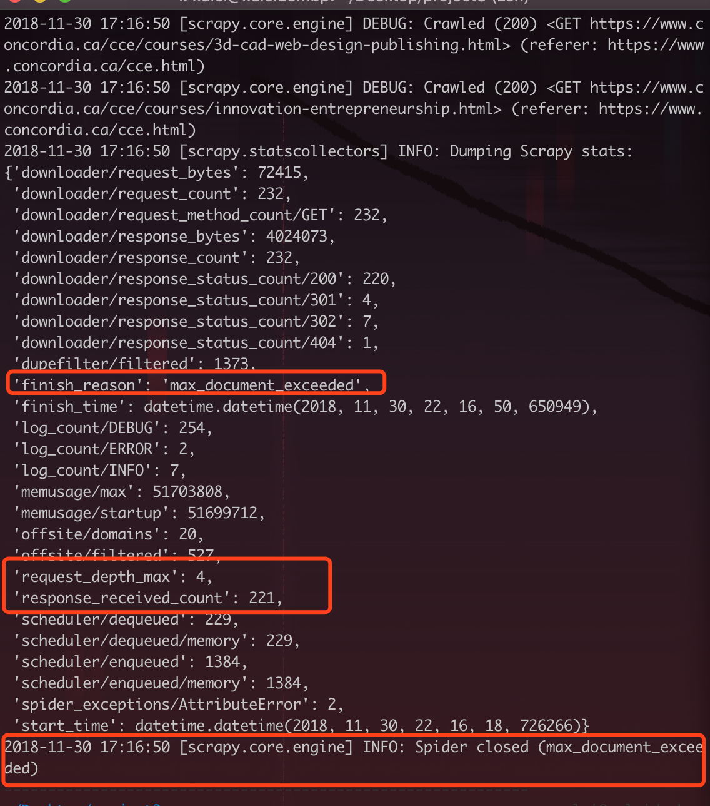
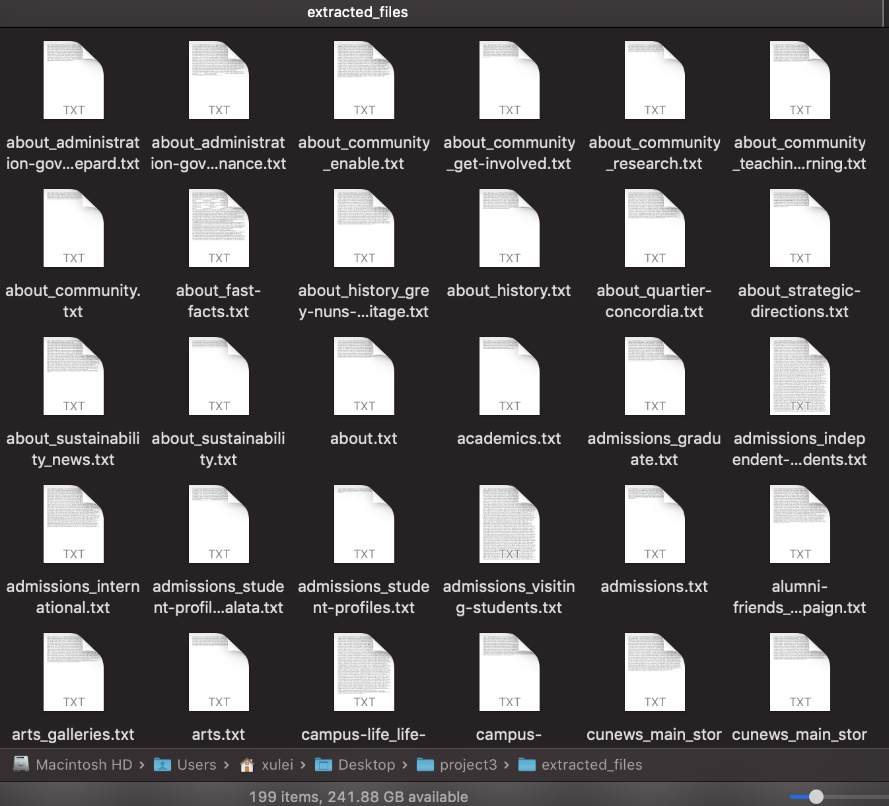
<p style="font-size:10px;font-color:#969696">Figure 4.1 Crawling Testing Result </p>
</div>

### 4.2 Indexing Test

1. **Case 1**

	***Purpose:***
	
	Check whether the **SPIMI** algorithm works through the following two parts
	
	1. Block fils
	2. Final index file.
	
	***Steps:***
	
	1. Open a termianl and go to the project directory.
	2. Run the **python3 spimi.py** command. 
	3. Check the result.

	***Note:*** 
	
	(**How big is the index?**)
	
	The size of the final index is **4.6 MB**
	
	(**How did you define what constitutes a document in our index?**)
	
	The structure of item in the final index is {term : [ [doc_title, tf, sentiment_value, tf_idf_weight], [posting#2], [posting#3],...]}
	
	***Results:***
	
	<div align=center>
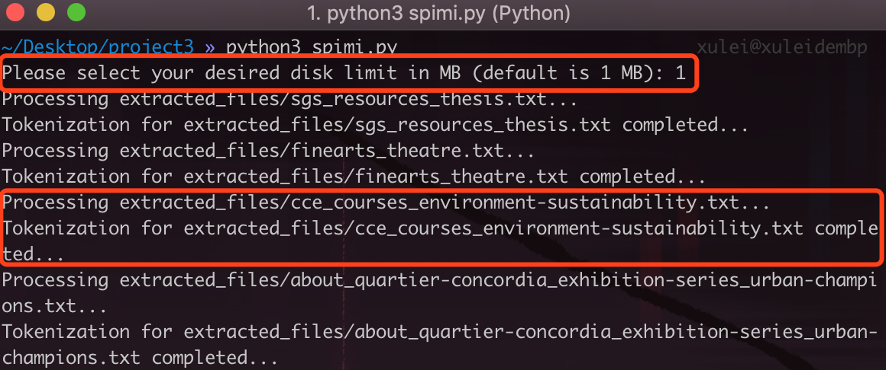
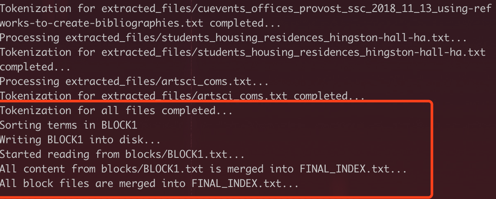
<p style="font-size:10px;font-color:#969696">Figure 4.2 Indexing Testing Result - Console </p>
</div>
	
	<div align=center>

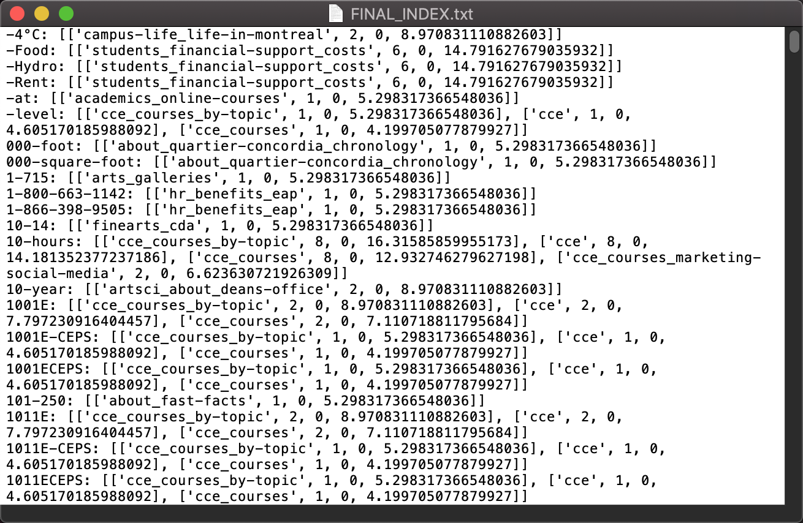
<p style="font-size:10px;font-color:#969696">Figure 4.3 Indexing Testing Result - Documents </p>
</div>

### 4.3 Ranking Test

#### 4.3.1 Scenario 01 - **Multiple Keyword Query**

1. **Case 1**

	***Purpose:***
	
	Check whether the program can return the correct result when doing a single keyword (**Positive**) query.
	
	***Steps:***
	
	1. Open a termianl and go to the project directory.
	2. Run the **python3 rank_document.py** command. 
	3. Enter positive keywords, like **amazing creativity powers**
	4. Check the result.
	
	***Results:***
	
	<div align=center>
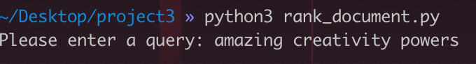
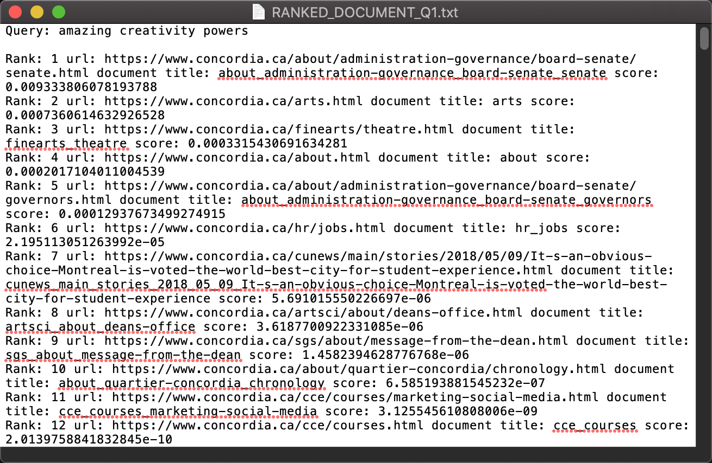
<p style="font-size:10px;font-color:#969696">Figure 4.4 Multiple Positive Keywords Query </p>
</div>

2. **Case 2**

	***Purpose:***
	
	Check whether the program can return the correct result when doing a single keyword (**Neutral**) query.
	
	***Steps:***
	
	1. Open a termianl and go to the project directory.
	2. Run the **python3 rank_document.py** command.
	3. Enter neutral keywords, like **creativity powers**
	4. Check the result.
	
	***Results:***
	
	<div align=center>
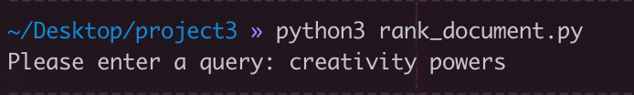
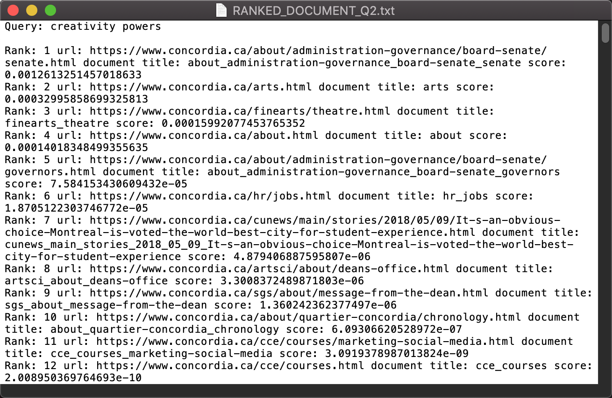
<p style="font-size:10px;font-color:#969696">Figure 4.5 Multiple Neutral Keywords Query </p>
</div>

3. **Case 3**

	***Purpose:***
	
	Check whether the program can return the correct result when doing a single keyword (**Negative**) query.
	
	***Steps:***
	
	1. Open a termianl and go to the project directory.
	2. Run the **python3 rank_document.py** command.
	3. Enter negative keywords, like **disappointing creativity powers**
	4. Check the result.
	
	***Results:***
	
	<div align=center>
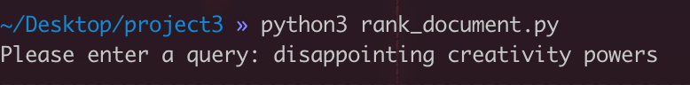

<p style="font-size:10px;font-color:#969696">Figure 4.6 Multiple Negative Keywords Query </p>
</div>

<!--### 4.2 Scenario 02 - **Multiple Keywords Query**

1. **Case 1**

	***Purpose:***
	
	Check whether the program can return the correct result when doing a multiple keywords (**Total Positive**) query.
	
	***Steps:***
	
	1. Open a termianl and go to the project directory.
	2. Run the **main.py** file with the memory size argument. **python main.py 1**
	3. Enter a keyword, like **johns**
	4. Check the result.
	
	***Hypothesis & Analysis:***
	
	The console shows **"Document Results:  [7144, 10890, 21277]"**
	
	***Results:***
	
	<div align=center>

<p style="font-size:10px;font-color:#969696">Figure 4.4 Multiple Keywords Query (Total Positive) </p>
</div>

2. **Case 2**

	***Purpose:***
	
	Check whether the program can return the correct result when doing a multiple keywords (**Total Neutral**) query.
	
	***Steps:***
	
	1. Open a termianl and go to the project directory.
	2. Run the **main.py** file with the memory size argument. **python main.py 1**
	3. Enter a keyword, like **johns**
	4. Check the result.
	
	***Hypothesis & Analysis:***
	
	The console shows **"Document Results:  [7144, 10890, 21277]"**
	
	***Results:***
	
	<div align=center>

<p style="font-size:10px;font-color:#969696">Figure 4.5 Multiple Keywords Query (Total Neutral) </p>
</div>

3. **Case 3**

	***Purpose:***
	
	Check whether the program can return the correct result when doing a multiple keywords (**Total Negative**) query.
	
	***Steps:***
	
	1. Open a termianl and go to the project directory.
	2. Run the **main.py** file with the memory size argument. **python main.py 1**
	3. Enter a keyword, like **johns**
	4. Check the result.
	
	***Hypothesis & Analysis:***
	
	The console shows **"Document Results:  [7144, 10890, 21277]"**
	
	***Results:***
	
	<div align=center>

<p style="font-size:10px;font-color:#969696">Figure 4.6 Multiple Keywords Query (Total Negative) </p>
</div>-->
